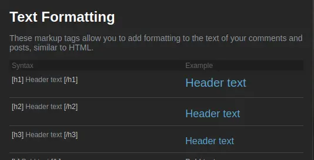

<!-- mediaUrlPrefix:https://codeberg.org/catsoft/markdown-to-steam/media/branch/main/ -->

# markdown-to-steam

Converts regular markdown to steam-flavored markdown.\
This tool mainly follows [steam's syntax guide](https://steamcommunity.com/comment/Recommendation/formattinghelp).


## Usage

- Configure base media links
    `` that don't start with `http` get that prepended to their link. Set the following at the start of your Markdown file :
```
<!-- mediaUrlPrefix:https://codeberg.org/catsoft/RainWorldMods/media/branch/main/BackgroundPreview/ -->
```
- run `./main file.md [output.file]` 
- profit

## Supports : 

### headings (up to level 3)

~~striked text~~\
**bold text**\
*italic text* (with  `*` or `_`)\
__underlined text__ (with `__`  or `<u><\u>`)\
```Code blocks``` (Not inline, big blocks only)\
``tiny [i]code[/i] *blocks*``  (will not convert, and steam will not render)\

---
`---` separators\
- lists (first level only)

`<!-- comments will show up in processed html as a zero-width table -->`\
<!-- like this -->
`` will only work if the format is avif or webm, will convert into a link else\
`[hyperlinks](https://exemple.com)`
\*\*escaped syntax\*\*. You should escape any symbols you don't want the converter to interpret. Symbols include \*, \_,\~, \`, \|, and \#, \- if you want to put them on the start of a line 
Links and hyperlinks will be prepended with whatever link you choose, if they don't start with http\*. 
    

## Does not support
- Multi-level lists


## image and links examples

current page:
[here](./README.md);
webp media :

webm media :

webp media (full path) :

